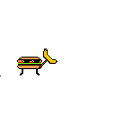

# guerra_dos_numeros

 

**Guerra dos Números** é um jogo educativo desenvolvido para tornar o aprendizado das operações básicas de matemática uma experiência divertida e envolvente.

## Sobre o jogo

Adentre em um universo fictício onde uma emocionante batalha é travada entre dois personagens peculiares: um hambúrguer e um robô. À medida que o jogador responde às questões matemáticas, a batalha avança e o destino dos personagens está nas mãos do usuário, que determinará o vencedor dessa empolgante disputa.

## Instalação

Para baixar e instalar o nosso aplicativo, siga os passos abaixo:

<ol>
  <li> Aponte a câmera para o QRcode abaixo ou clique aqui para acessar o link diretamente.</li>
</ol>
  
- Caso o QR Code não funcione, você pode tentar acessar pelo <a href="https://drive.google.com/file/d/18jXQYSmGPSGrs5HAyvlri4QwDlekr5IF/view?usp=sharing" target="_BLANK">link direto</a> ou tente acessar pelo link: https://encurtador.com.br/nsABF

## Desenvolvimento

**O jogo foi desenvolvido por alunos de engenharia da computação, unindo habilidades e paixões em busca de uma experiência única:** 
- Carlos Lamark de Barros Alencar - Programador
- Gerson Vinicius Rodrigues de Macedo - Programador
- Maria Clara Mendes da Silva - Designer e Product Owner (PO)
- Luiz Fernando Barbosa da Silva - Programador
- Richard Lima ribeiro - Programador e Scrum Master

## Contato
Se você tiver alguma dúvida, sugestão ou precisa relatar algum problema, entre em contato conosco pelo email: contato@guerradosnumeros.com

Divirta-se e bons estudos!
